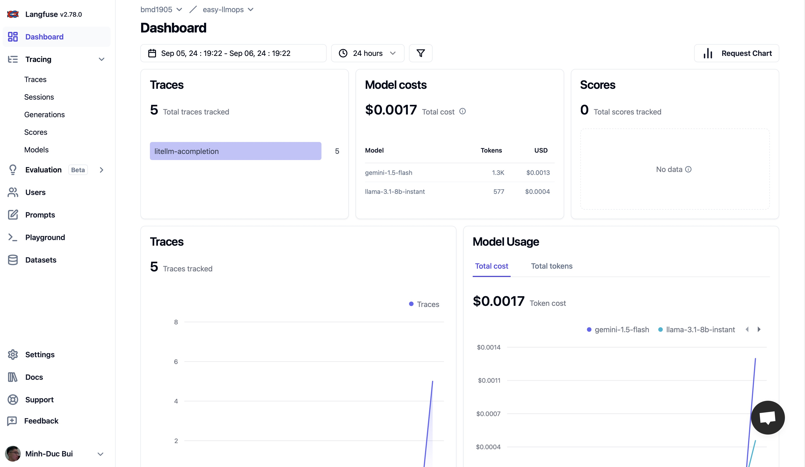
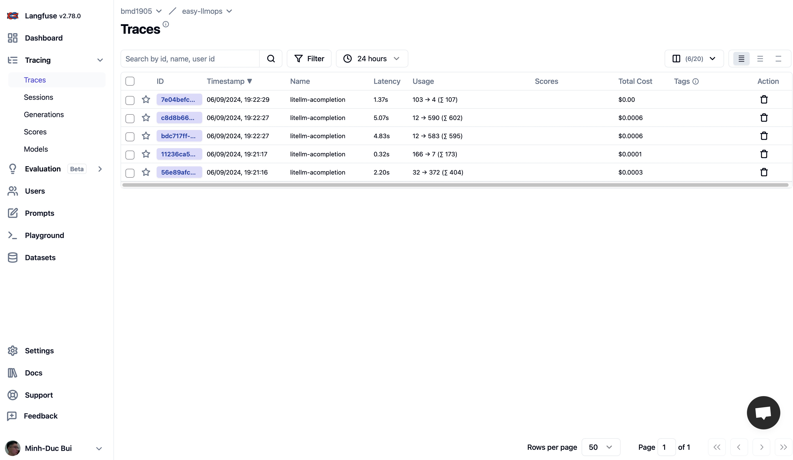

# ChatOpsLLM

> A cloud-native LLMOps platform for real-time chat, semantic caching, RAG ingestion, model gateway routing, observability, and Kubernetes deployment.

**Author:** Tran Quy Dat

**Email:** [tranquydat.work@gmail.com](mailto:tranquydat.work@gmail.com)


---

## Overview

ChatOpsLLM is an end-to-end LLMOps system that combines application serving, model routing, retrieval-augmented generation, observability, and CI/CD into one Kubernetes-ready platform.

The system is designed around these production concerns:

- Serve conversational AI through a Web UI and FastAPI WebSocket endpoint.
- Route model calls through LiteLLM to hosted providers and self-hosted inference backends.
- Reduce repeated inference cost with a Redis semantic cache.
- Process long-running generation tasks asynchronously with RabbitMQ and Celery.
- Ingest raw documents from MinIO through Airflow, chunk them, embed them, and store vectors in Qdrant.
- Track LLM traces, token usage, latency, and model cost in Langfuse.
- Monitor infrastructure with Prometheus, Grafana, Alertmanager, Discord alerts, and ELK logging.
- Build, push, and deploy workloads through Jenkins, Docker, Docker Hub, Helm, Terraform, and Ansible.

---

## Architecture


The architecture is divided into the same areas shown in the diagram:

| Area | Main components | Responsibility |
| --- | --- | --- |
| CI/CD and infrastructure | GitHub, Jenkins, Docker, Docker Hub, Helm, Ansible | Build images, push artifacts, bootstrap Jenkins, and deploy workloads. |
| Kubernetes application layer | Kong Gateway, Web UI, FastAPI | Receive user traffic, route requests, and stream chat responses. |
| Model-serving namespace | RabbitMQ, Celery worker, Redis, LiteLLM | Queue work, cache semantic responses, and route LLM requests. |
| Database layer | Qdrant, PostgreSQL | Store vectors for RAG and persist application data. |
| Data ingestion pipeline | Raw data, Airflow, MinIO, chunk, embed, store | Transform raw documents into searchable vector records. |
| External services | Gemini, OpenAI, Anthropic, BentoML, vLLM, Langfuse | Provide hosted/self-hosted LLMs and LLM observability. |
| Logging namespace | Beats, Logstash, Elasticsearch, Kibana | Ship, transform, store, and visualize logs. |
| Monitoring namespace | Prometheus, Grafana, Alertmanager, Discord | Scrape metrics, visualize health, and send alerts. |

---

## Architecture Walkthrough

### 1. User Request Path

```text
User
  -> Kong Gateway
  -> Web UI
  -> WebSocket connection
  -> FastAPI
  -> Model-serving namespace
```

Kong acts as the platform ingress layer. The Web UI opens a socket connection to FastAPI, allowing the backend to stream model tokens back to the browser instead of waiting for a full completion.

### 2. Model Serving Path

```text
FastAPI
  -> Redis semantic cache
      -> hit: return cached answer
      -> miss: enqueue or execute generation
  -> RabbitMQ
  -> Celery worker
  -> LiteLLM
  -> API provider or self-hosted model
```

Redis is used as the semantic cache. RabbitMQ and Celery decouple request handling from expensive generation work. LiteLLM provides the model gateway, so the application can call Gemini, OpenAI, Anthropic, BentoML, or vLLM-style backends through one routing layer.

### 3. Data Ingestion Path

```text
Raw data
  -> Airflow load task
  -> MinIO storage
  -> chunk task
  -> embed task
  -> store task
  -> Qdrant
```

The Airflow DAG `chatopsllm_ingest_pipeline` loads raw documents, splits text into chunks, generates embeddings, and stores vectors plus metadata in Qdrant. The resulting vector store is used by the RAG retriever.

### 4. CI/CD Path

```text
Developer commit
  -> GitHub webhook
  -> Jenkins
  -> Docker build
  -> Docker Hub push
  -> Helm / Kubernetes deploy
```

Ansible sets up Jenkins. Jenkins receives repository events, builds Docker images, pushes them to Docker Hub, and deploys the application into Kubernetes using Helm charts or manifests.

### 5. Observability Path

```text
Application logs
  -> Beats
  -> Logstash
  -> Elasticsearch
  -> Kibana

Application and cluster metrics
  -> Prometheus
  -> Grafana
  -> Alertmanager
  -> Discord

LLM calls
  -> LiteLLM callbacks
  -> Langfuse
```

The platform separates operational monitoring from LLM observability. Prometheus and Grafana monitor system health; ELK handles logs; Langfuse tracks model calls, token usage, latency, cost, and traces.

---

## Core Features

- **Streaming chat:** FastAPI exposes `/ws/chat` for real-time token streaming.
- **Prompt orchestration:** user prompts are processed through conversation and prompt-enhancement handlers.
- **Semantic caching:** Redis returns previously generated answers for semantically similar prompts.
- **Async execution:** RabbitMQ and Celery support queued generation through `/api/v1/chat/async`.
- **Model gateway:** LiteLLM routes requests to multiple hosted and self-hosted providers.
- **RAG ingestion:** Airflow, MinIO, chunking, embeddings, and Qdrant provide a document-to-vector pipeline.
- **Trace observability:** Langfuse records model traces, generations, latency, usage, and cost.
- **Platform monitoring:** Prometheus, Grafana, and Alertmanager cover infrastructure and application metrics.
- **Centralized logging:** Beats, Logstash, Elasticsearch, and Kibana provide a full log pipeline.
- **Cloud deployment:** Jenkins, Docker, Docker Hub, Helm, Terraform, and Ansible support repeatable delivery.

---

## Langfuse Observability

LiteLLM callbacks are configured to send successful and failed generations to Langfuse:

```python
litellm.success_callback = ["langfuse"]
litellm.failure_callback = ["langfuse"]
```

Langfuse dashboard:



Langfuse traces:



---

## Technology Stack

| Layer | Technology |
| --- | --- |
| Backend API | FastAPI, Uvicorn, Pydantic, SlowAPI |
| Realtime transport | WebSocket |
| Worker queue | RabbitMQ, Celery |
| Cache | Redis semantic cache |
| Model gateway | LiteLLM |
| Hosted providers | Gemini, OpenAI, Anthropic |
| Self-hosted providers | BentoML, vLLM |
| RAG vector database | Qdrant |
| Application database | PostgreSQL |
| Data lake / object storage | MinIO |
| Data orchestration | Apache Airflow |
| LLM observability | Langfuse |
| Metrics | Prometheus, Grafana, Alertmanager |
| Logging | Beats, Logstash, Elasticsearch, Kibana |
| Gateway / ingress | Kong Gateway, NGINX Ingress |
| CI/CD | Jenkins, Docker, Docker Hub, Helm |
| Infrastructure | Terraform, Ansible, Kubernetes / GKE |

---

## Repository Structure

```text
.
+-- apps/
|   +-- api/
|   |   +-- chatopsllm_api/
|   |   |   +-- cache/               # Redis semantic cache
|   |   |   +-- callbacks/           # LiteLLM and Langfuse callbacks
|   |   |   +-- chat_completion/     # Conversation handler and prompt enhancer
|   |   |   +-- configs/             # Prompt and LiteLLM config modules
|   |   |   +-- llms/                # LLM clients and abstractions
|   |   |   +-- rag/                 # Qdrant embeddings, retriever, vector store
|   |   |   +-- schemas/             # Pydantic schemas
|   |   |   +-- websocket/           # WebSocket chat handler
|   |   |   +-- worker/              # Celery application and tasks
|   |   +-- tests/                   # API, RAG, cache, worker, WebSocket tests
|   |   +-- Dockerfile
|   |   +-- docker-compose.yaml
|   |   +-- litellm_config.yaml
|   |   +-- pyproject.toml
|   +-- data_pipeline/
|   |   +-- chunks/                  # Text chunking
|   |   +-- dags/                    # Airflow ingestion DAG
|   |   +-- embeddings/              # Embedding generation
|   |   +-- storage/                 # MinIO and Qdrant upload clients
|   +-- gradio/                      # Optional Gradio interface
|   +-- web/                         # Web client
+-- assets/
|   +-- images/                      # Architecture and Langfuse screenshots
+-- ci/
|   +-- Jenkinsfile                  # CI/CD pipeline
+-- deployments/
|   +-- ELK/                         # Logging manifests
|   +-- kong/                        # Kong Gateway chart
|   +-- litellm/                     # LiteLLM chart
|   +-- monitoring/                  # Prometheus/Grafana stack
|   +-- nginx-ingress/               # NGINX ingress chart
|   +-- redis/                       # Redis chart
+-- iac/
|   +-- ansible/                     # Jenkins bootstrap automation
|   +-- terraform/                   # GKE infrastructure
+-- scripts/                         # Cluster helper scripts
+-- tests/                           # Shared and load tests
+-- third_party/open-webui/           # Open WebUI integration
```

---

## API Surface

| Method | Path | Purpose |
| --- | --- | --- |
| `GET` | `/health` | Liveness probe. |
| `GET` | `/ready` | Readiness probe. |
| `GET` | `/api/v1/openapi.json` | OpenAPI schema. |
| `WS` | `/ws/chat` | Streaming chat endpoint. |
| `POST` | `/api/v1/chat/async` | Enqueue an async generation task. |
| `GET` | `/api/v1/chat/async/{task_id}` | Poll async task state and result. |
| `POST` | `/api/v1/rag/ingest` | Embed and store text chunks in Qdrant. |

---

## Requirements

- Python 3.10+
- Poetry
- Node.js 18+
- Docker and Docker Compose
- Redis for local semantic cache
- Kubernetes, Helm, Terraform, Ansible, Jenkins, and GKE access for full production deployment

---

## Environment Variables

Create local environment files from the examples:

```bash
cp .env.example .env
cp apps/web/.env.example apps/web/.env
```

Root environment variables:

| Variable | Purpose |
| --- | --- |
| `GEMINI_API_KEY` | Gemini provider key for LiteLLM. |
| `OPENAI_API_KEY` | OpenAI provider key for LiteLLM. |
| `LANGFUSE_PUBLIC_KEY` | Langfuse public key. |
| `LANGFUSE_SECRET_KEY` | Langfuse secret key. |
| `LANGFUSE_HOST` | Langfuse server URL. |
| `MINIO_ROOT_USER` | MinIO root user. |
| `MINIO_ROOT_PASSWORD` | MinIO root password. |
| `REDIS_HOST` | Redis hostname. |
| `REDIS_PASSWORD` | Redis password. |
| `REDIS_PORT` | Redis port. |

---

## Local Development

Install API dependencies:

```bash
make api-install
```

Run the API locally:

```bash
make api-run
```

The standalone API runs at:

```text
http://localhost:30000
```

Run the Web UI:

```bash
make web-install
make web-run
```

The Web UI runs at:

```text
http://localhost:3000
```

Run the containerized API stack:

```bash
cd apps/api
cp ../../.env.example .env
docker compose up --build
```

Container ports:

| Port | Service |
| --- | --- |
| `8000` | API container port |
| `4000` | LiteLLM proxy |
| `6379` | Redis |

---

## LiteLLM Configuration

Default model routing is defined in `apps/api/litellm_config.yaml`.

| Alias | Provider model |
| --- | --- |
| `gemini-flash` | `gemini/gemini-1.5-flash-latest` |
| `gpt-4o-mini` | `openai/gpt-4o-mini` |

To add a new provider, add an entry to `model_list` and provide the corresponding API key through environment variables.

---

## Testing

Run API tests:

```bash
make api-test
```

Run tests from the API workspace:

```bash
cd apps/api
poetry run pytest
```

Run shared root tests:

```bash
pytest tests
```

---

## Code Quality

Run formatting and linting from the API workspace:

```bash
cd apps/api
make lint-fix
make test
```

Equivalent direct commands:

```bash
poetry run ruff format .
poetry run ruff check .
poetry run isort .
```

---

## Kubernetes Deployment

Deployment assets are grouped by platform responsibility:

| Path | Responsibility |
| --- | --- |
| `deployments/kong` | Kong Gateway Helm chart. |
| `deployments/litellm` | LiteLLM proxy Helm chart. |
| `deployments/redis` | Redis Helm chart. |
| `deployments/nginx-ingress` | NGINX ingress controller chart. |
| `deployments/monitoring` | Prometheus, Grafana, Alertmanager stack. |
| `deployments/ELK` | Elasticsearch, Logstash, Kibana, Beats logging stack. |

Example LiteLLM deployment:

```bash
helm upgrade --install litellm deployments/litellm \
  --namespace model-serving \
  --create-namespace
```

Cluster helper:

```bash
make cluster-up
```

---

## Infrastructure and CI/CD

| Path | Purpose |
| --- | --- |
| `iac/terraform` | GKE and cloud infrastructure definitions. |
| `iac/ansible/deploy_jenkins` | Jenkins provisioning and setup. |
| `ci/Jenkinsfile` | Build, push, and Kubernetes deployment pipeline. |

Run a Terraform plan:

```bash
make infra-plan
```
